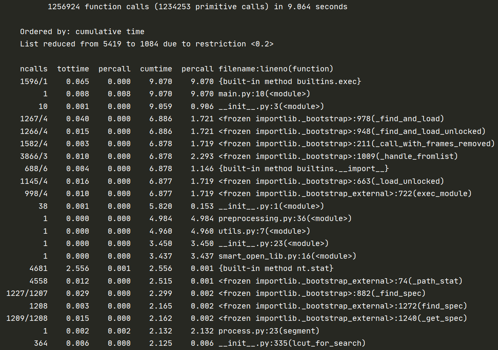

:point_right: ​这里先附上[Github Repo Link](https://github.com/Tomspiano/2020SE-K/tree/master/181800331/01) :point_left:

*未更新完，先占个坑。。。*

# 需求

**题目：论文查重**

描述如下：

设计一个论文查重算法，给出一个原文文件和一个在这份原文上经过了增删改的抄袭版论文的文件，在答案文件中输出其重复率。

> 原文示例：今天是星期天，天气晴，今天晚上我要去看电影。
>
> 抄袭版示例：今天是周天，天气晴朗，我晚上要去看电影。

要求输入输出采用文件输入输出，规范如下：

- 从**命令行参数**给出：论文原文的文件的**绝对路径**。
- 从**命令行参数**给出：抄袭版论文的文件的**绝对路径**。
- 从**命令行参数**给出：输出的答案文件的**绝对路径**。


# 解决方案

## 1. 计算模块接口的设计与实现过程

**代码的总设计结构如下：**


- #### 读取文本

  先处理从命令行读取到的参数，即文本路径。读取文件时注意使用`utf-8`编码。

- #### 文本预处理

  首先，生成停用词表`get_stopwords()`，这里引用了[goto456的中文停用词表](https://github.com/goto456/stopwords/blob/master/cn_stopwords.txt)。注意一下，在测试须知里提到**不允许读写其他文件！！**于是只能手动生成停用词表:no_mouth:（运行[`process.py`](https://github.com/Tomspiano/2020SE-K/blob/master/181800331/01/release/dcheck/process.py)，从输出的文件中获得相应字典）。

  接着，先对文本分段，再用[`jieba`](https://github.com/fxsjy/jieba)分词。这里使用了搜索引擎模式`jieba.lcut_for_search`，因为考虑到无法针对测试集自定义词典，而论文中的专有名词较多，精确模式在这种情况下分词效果可能不够好。

  最后，从得到的分词列表中过滤掉出现在停用词表中的词。分段、分词、过滤均封装在函数`segment()`中。

  以上函数均在[`process.py`](https://github.com/Tomspiano/2020SE-K/blob/master/181800331/01/release/dcheck/process.py)中定义。

- #### 相似度模型

  我设计的模型是**[Jaccard index](https://blog.csdn.net/qq_34333481/article/details/84024513) + [Cosine similarity](http://www.ruanyifeng.com/blog/2013/03/cosine_similarity.html)**。之所以选择这个组合，是因为一开始我联想到在CV目标检测中有个[IoU](https://blog.csdn.net/gaoyu1253401563/article/details/86484851)（其实就是Jaccard index），用来衡量锚框（anchor box）与真实边界框（ground-truth bounding box）之间的相似度。而查重也是度量两篇文章之间的相似度，它们之间的相似度与使用到相同词的个数正相关。Jaccard index计算公式：

  $$J(\mathcal{A},\mathcal{B}) = \frac{\left|\mathcal{A} \cap \mathcal{B}\right|}{\left| \mathcal{A} \cup \mathcal{B}\right|}.$$

  但是只用Jaccard index显然不够，我们还能进行更精细的度量。Jaccard index只衡量了两个文本之间用词的重叠度，而忽略了词语在文本中出现的频率——**[词频TF](https://www.ruanyifeng.com/blog/2013/03/tf-idf.html)**。设想，若一个文本通篇讲半导体芯片，另一个文本只是科普性文章，顺带提到了半导体芯片，那么它们的Jaccard index有可能较大。因此，我对两个文本分别计算了共同出现词的词频：

  $$词频(TF)=\frac{某个词在文章中的出现次数}{文章的总词数},$$

  并依此写出词频向量，利用Cosine similarity衡量它们的相似度：

  $$\cos<\vec a, \vec b>=\frac{\vec a \cdot \vec b}{\| \vec a \|  \| \vec b \|}.$$

  *尝试画图。。。（词空间用二维平面表示）*

  

  最后，定义相似度：

  $$Sim = J(\mathcal{A},\mathcal{B}) \times \cos<\vec a, \vec b>.$$

  *注：词频计算封装在函数[`get_tf`](https://github.com/Tomspiano/2020SE-K/blob/master/181800331/01/release/dcheck/compare.py)中。*

- #### 输出

  和读取文本一样，注意使用`utf-8`编码。

## 2. 计算模块接口部分的性能改进

执行如下命令：

```
python -m cProfile -o profile.stats main.py ..\sample\sim_0.8\orig.txt ..\sample\sim_0.8\orig_0.8_mix.txt ..\output\sim_0.8\mix.txt
```

再运行[`show.py`](https://github.com/Tomspiano/2020SE-K/blob/master/181800331/01/release/show.py)得到：



## 3. 计算模块部分单元测试展示

## 4. 计算模块部分异常处理说明

- 命令行参数输入格式错误
- 命令行参数给出的文件路径不存在
- 两个文档都是空白的，无法计算Jaccard index
- 若杰卡德指数为零，则无需计算Cosine similarity


# PSP2.1

| Personal Software Process Stages     | Estimate (min) | Actual (min) |
| :----------------------------------- | :------------- | :-------- |
| **Planning**                         |                |              |
| · Estimate                           | 60 | 30 |
| **Development**                      |                |              |
| · Analysis                           | 180 | 1200 |
| · Design Spec                        | 90 | 60 |
| · Design Review                      | 30 | 30 |
| · Coding Standard                    | 30 | 20 |
| · Design                             | 180 | 150 |
| · Coding                             | 90 | 120 |
| · Code Review                        | 60 | 60 |
| · Test                               | 300 | 240 |
| **Reporting**                       |                |              |
| · Test Report                        | 90 | 180 |
| · Size Measurement                   | 60 | 30 |
| · Postmortem & Process Improvement Plan | 60 | 40 |
| **TOTAL**                            | 1230 | 2160 |


---

## 写在后面

- 一开始看到题目是“论文查重”的OS：这是要训练一个神经网络模型？？？找数据集好麻烦:confused:。​深入思考后发觉不对，测试就只输入两个文件，还没有给测试文章的主题范围，数据集难以建立。后来想用gensim里的模型，得到的结果却不是很理想，要么很接近$1$，要么很接近$0$（到现在还没整明白为啥:no_mouth:）。Deadline马上要到了，最后只好自己手写一个:pensive:。这次走了很多弯路，主要是因为**对需求的分析不够到位**。另外，**对python的运用不够熟练**也导致了长耗时。

- **收获：**认识了性能分析工具；使用了单元测试对项目进行测试；理解了PSP的设计思想。

- **遗憾：**来不及对模型进行对比分析，还不是很懂如何改进性能和进行单元测试。

  > 再给我一个周末吧:sob:，今晚deadline前肯定搞不完。不说了，先去和量子力学对线。。。
  >
  > 